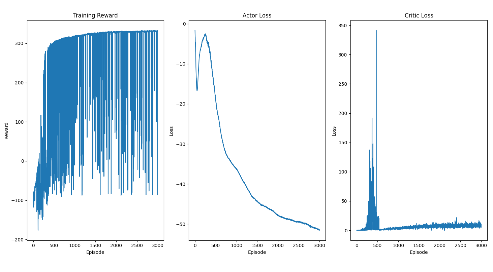

# Soft Actor-Critic for BipedalWalker-v3


A PyTorch implementation of Soft Actor-Critic (SAC) algorithm for the BipedalWalker-v3 environment.

## Overview

This project trains an AI agent to walk using the SAC algorithm, which combines policy gradients with Q-learning and includes automatic entropy tuning for better exploration.

## Training Results



The agent starts converging around 800-1000 episodes and achieves stable scores of 330+ around 1000-1500 episodes.

## Requirements

```bash
pip install torch gymnasium numpy matplotlib
```

## Files

- `main.py` - Training and testing script
- `Agent.py` - SAC agent implementation
- `model/` - Saved models directory